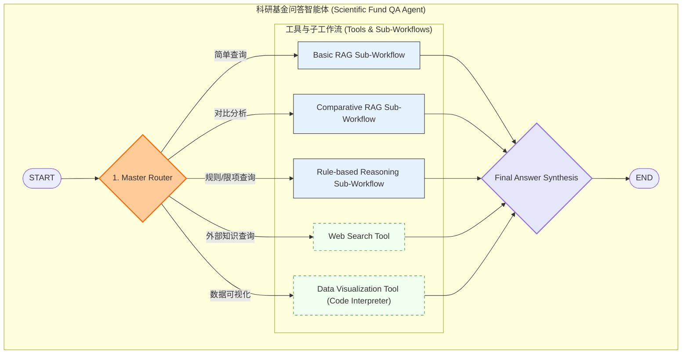

好的，这是一个非常棒的挑战！我们来基于现有项目的坚实基础，设计一个全新的、能够应对这些复杂科研基金问题的智能体。

首先，对这7个问题的分析是关键，因为它决定了我们的 Agent 需要具备哪些核心能力。

### 1. Agent 所需的核心能力分析

通过剖析这7个问题，我们可以识别出 Agent 必须具备的、远超简单 RAG 的高级能力：

1.  **基础 RAG 能力 (Basic RAG)**
    *   **对应问题**: 问题1。
    *   **能力描述**: 对**单一文档**进行信息检索和回答。这是最基本的能力。

2.  **多文档对比分析能力 (Multi-document Comparative Analysis)**
    *   **对应问题**: 问题2。
    *   **能力描述**: 能够同时从**多个不同来源（如2024和2025的指南）**中检索信息，并对这些信息进行比较、总结差异或寻找新增点。

3.  **复杂条件合成能力 (Multi-constraint Synthesis)**
    *   **对应问题**: 问题3、问题4、问题5。
    *   **能力描述**: 能够理解和拆解用户问题中包含的**多个约束条件**（如：`同济大学` + `在职博士` + `青年科学基金`），然后在知识库中寻找同时满足所有条件的答案，并进行整合。

4.  **规则推理与应用能力 (Rule-based Reasoning)**
    *   **对应问题**: 问题5。
    *   **能力描述**: 能够理解并应用文档中的“规则”（如基金的限项规定）。它需要先检索到规则，然后将用户的具体情况作为输入，应用这些规则进行逻辑判断，并给出解释。

5.  **外部工具调用能力 (External Tool Use)**
    *   **对应问题**: 问题6。
    *   **能力描述**: Agent 不能只局限于提供的文档。它需要一个“逃生舱”，当问题无法从本地知识库回答时（如查询最新的期刊论文），能够调用外部工具，如 **Web 搜索引擎**（SerpAPI, Tavily 等）。

6.  **数据可视化能力 (Data Visualization)**
    *   **对应问题**: 问题7。
    *   **能力描述**: 能够从文本中提取结构化数据（如评审指标和权重），并调用代码解释器或绘图库（如 Matplotlib, Plotly）来生成图表。

7.  **意图识别与任务规划能力 (Intent Recognition & Task Planning)**
    *   **对应所有问题**: 这是所有能力的基础。Agent 需要一个“大脑”来首先判断用户问题的类型（是简单查询、对比分析还是规则应用？），然后规划出解决该问题所需的步骤（是先RAG、再对比，还是直接调用Web搜索？）。

### 2. 新 Agent 架构与工作流设计 (基于 LangGraph)

我们将采用一个比原项目更强大的 **“分层规划与工具调用（Hierarchical Planning and Tool-Use）”** 架构。这个架构的核心是一个**主路由器（Master Router）**，它负责理解问题并将其分发给专门的**子工作流（Sub-Workflows）**。

下面是使用 Mermaid 设计的架构图：

### 3. 工作流详解

#### **第1步：主路由器 (Master Router)**
*   **功能**: 这是 Agent 的大脑。它接收用户的原始问题，其核心任务是**意图识别**。
*   **实现**: 这是一个由 LLM 驱动的节点，它的 Prompt 会包含所有可用工具和子工作流的描述。LLM 的任务是分析问题，并决定将任务分发给哪个下游模块。
    *   **输入**: `用户问题`
    *   **输出**: 一个决策，指明要调用的工具/工作流（如 `"Comparative RAG"`）以及传递给该模块的参数（如 `query: "2024 vs 2025 经费包干制", docs: ["2024_guide.pdf", "2025_guide.pdf"]`）。

#### **第2步：专业化的子工作流与工具**

1.  **Basic RAG Sub-Workflow (C)**
    *   **处理问题**: 问题1。
    *   **流程**: `Retrieve -> Rerank -> Generate Answer`。一个标准的 RAG 流程，用于处理简单的查询。

2.  **Comparative RAG Sub-Workflow (D)**
    *   **处理问题**: 问题2、问题4。
    *   **流程**:
        1.  **并行检索 (Parallel Retrieval)**: 根据路由器的指令，同时从多个文档（如2024和2025指南）中检索相关信息。
        2.  **信息聚合 (Information Aggregation)**: 将从不同来源检索到的信息分别标记和汇总。
        3.  **对比生成 (Comparative Generation)**: 调用 LLM，传入聚合后的信息，并使用一个专门的“对比分析” Prompt 来生成答案。

3.  **Rule-based Reasoning Sub-Workflow (E)**
    *   **处理问题**: 问题3、问题5。
    *   **流程**:
        1.  **条件与规则提取 (Constraint & Rule Extraction)**: 首先从用户问题中提取所有约束条件（如“高级职称”、“正在承担杰青项目”）。然后从文档中检索相关的“规则条文”（如限项规定）。
        2.  **逻辑应用 (Logical Application)**: 调用 LLM，将“规则”和“个人情况”同时传入，并使用一个“法律顾问”或“规则裁判”角色的 Prompt，让 LLM 根据规则进行判断。
        3.  **引用生成 (Citation Generation)**: 要求 LLM 在给出结论的同时，必须引用作为判断依据的原文条款。

4.  **Web Search Tool (F)**
    *   **处理问题**: 问题6。
    *   **实现**: 一个简单的工具节点，它接收查询（如“Nature journal latest issue”），调用外部 API（如 Tavily Search），然后返回搜索结果。

5.  **Data Visualization Tool (G)**
    *   **处理问题**: 问题7。
    *   **实现**: 一个代码解释器节点。
        1.  **数据提取**: 首先通过 RAG 从文本中提取出需要可视化的数据（如“面上资助-通讯评审-40%，会议评审-60%”）。
        2.  **代码生成**: 调用 LLM 生成一段 Python 代码（使用 Matplotlib/Plotly）来绘制饼图。
        3.  **代码执行**: 在一个安全的环境中执行代码，并返回生成的图表图片。

#### **第3步：最终答案合成 (Final Answer Synthesis)**
*   **功能**: 这是一个统一的出口。它接收来自各个子工作流或工具的输出结果。
*   **实现**: 对结果进行格式化，确保答案清晰、完整，然后呈现给用户。如果结果是图表，就直接显示图片。

### 总结

与原项目相比，这个新设计：
*   **从“单一计划循环”演变为“路由分发模式”**：更灵活，能根据问题类型选择最优路径，而不是所有问题都走一遍冗长的 Plan-Execute 流程。
*   **专业化分工**: 每个子工作流都为一类特定任务做了优化，保证了处理复杂问题的深度和准确性。
*   **工具箱扩展**: 明确引入了 Web 搜索和代码执行能力，打破了封闭知识库的限制。

这个架构能够很好地应对您提出的7个挑战性问题，实现了从“通用规划”到“专家路由”的进化。