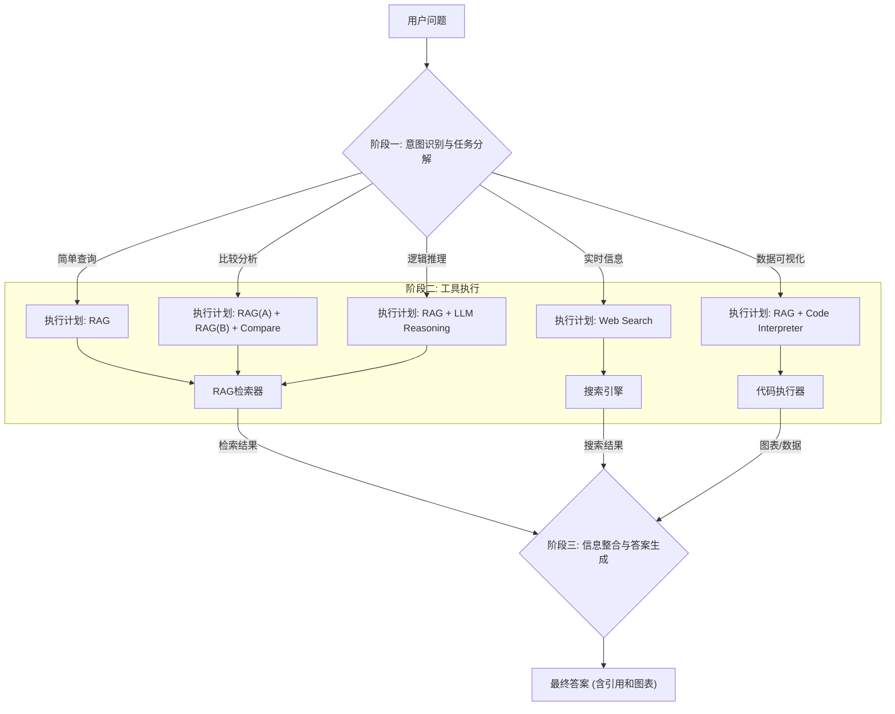

好的，我们来系统地分析您提出的这7个问题，并以此为基础，设计一个能够胜任此任务的智能体（Agent）所需具备的核心能力，以及实现这些能力的工作流编排。

### 一、 智能体（Agent）核心能力分析

通过分析这7个代表性问题，我们可以清晰地看到，一个先进的问答智能体需要具备远超“检索+问答”的多种能力。这些能力可以归纳为以下几个层面：

| **核心能力** | **能力描述** | **对应问题示例** |
| :--- | :--- | :--- |
| **1. 精准信息检索 (Accurate Retrieval)** | Agent的基础能力。能根据用户问题，从海量的、单一或多个文档中，精准定位到最相关的段落或数据。这是所有后续操作的前提。 | 问题1、问题4 |
| **2. 跨文档比较分析 (Cross-Document Comparison)** | 不满足于从单篇文档中找答案，需要能同时处理和比较来自不同版本或不同来源的文档，并总结出其中的差异、变化或关联。 | 问题2 |
| **3. 复杂逻辑推理 (Complex Logical Reasoning)** | Agent的高级能力。能够理解并应用文档中定义的复杂规则（如政策的限制性条款），并根据用户提供的具体情境进行逻辑判断和演绎，最终给出结论和解释。 | 问题5 |
| **4. 场景化信息综合 (Scenario-based Synthesis)** | Agent的共情和整合能力。能够理解用户提出的带有个人背景、身份、需求的复杂场景，并从知识库中抽取所有相关的条件、要求、流程，整合成一个完整的、个性化的行动指南。 | 问题3、问题4 |
| **5. 外部工具调用 (Tool Use & API Integration)** | Agent的扩展能力。当问题超出既有文档库的范围，特别是涉及实时性或外部数据时，需要能主动调用外部工具（如搜索引擎）来获取最新信息。 | 问题6 |
| **6. 数据处理与可视化 (Data Processing & Visualization)** | Agent的数据分析和呈现能力。能够从非结构化的文本中提取结构化数据（如指标、权重），并调用代码执行或图表生成工具，将数据以更直观的方式（如饼图、表格）呈现给用户。 | 问题7 |

---

### 二、 Agent工作流编排设计

为了实现上述能力，Agent的工作流不能是一个简单的线性过程。它必须是一个**“思考-行动”循环**的动态框架，通过智能编排（Orchestration）来决定每一步应该做什么。以下是一个推荐的工作流设计：

#### **阶段一：意图识别与任务分解 (Intent Recognition & Task Decomposition)**

这是整个工作流的“大脑”和“总调度师”。当Agent收到用户问题后，第一步不是直接去检索，而是理解问题的真实意图，并将其分解成一个或多个可执行的子任务。

*   **输入**：用户原始问题。
*   **处理**：
    1.  **意图分析**：判断问题类型。是简单查询？比较分析？规则判断？还是需要实时数据或可视化？
    2.  **任务规划**：根据意图，生成一个行动计划。
        *   **对于问题5**（限项规定）：计划可能是：① 识别用户身份和现有项目。② 在《2025年指南》中定位“限项申请规定”章节。③ 逐条将用户情况与规定进行逻辑匹配。④ 形成最终判断和解释。
        *   **对于问题7**（饼图）：计划可能是：① 在《2025博士后指南》中找到“面上资助”的“评审指标权重”。② 提取各项指标及其权重值。③ 调用**代码执行器**生成饼图。④ 整合图表和文字进行回答。
        *   **对于问题6**（Nature期刊）：计划可能是：① 识别到“最新一期”是实时信息。② 调用**搜索引擎**工具。③ 总结搜索结果。

#### **阶段二：工具选择与执行 (Tool Selection & Execution)**

根据规划好的任务，Agent从其“工具箱”中选择合适的工具来执行。

*   **工具箱列表**：
    *   **RAG检索器 (RAG Retriever)**：核心工具。负责从已经索引好的本地知识库（如2024和2025年的基金指南PDF）中检索相关文本片段。
    *   **搜索引擎 (Web Search API)**：用于获取知识库之外的、实时的外部信息。
    *   **代码执行器 (Code Interpreter)**：一个安全的沙箱环境，可以运行Python代码，用于数据处理、计算和生成图表（如使用`Matplotlib`或`Plotly`库）。
    *   **比较分析模块 (Comparison Module)**：一个由大模型驱动的特殊模块，接收两段或多段文本，专门用于寻找异同。

*   **执行流程**：
    *   **简单检索（问题1）**：调用`RAG检索器` -> 获得相关文本。
    *   **比较分析（问题2）**：并行调用`RAG检索器`两次（一次查2024文档，一次查2025文档） -> 将结果送入`比较分析模块`。
    *   **逻辑推理（问题5）**：调用`RAG检索器`获取规则文本 -> 将规则和用户场景一同交给大模型进行逻辑推理。
    *   **外部搜索（问题6）**：调用`搜索引擎` -> 获得网页结果。
    *   **数据可视化（问题7）**：调用`RAG检索器`获取数据文本 -> 大模型提取结构化数据 -> 将数据和绘图指令传给`代码执行器` -> 获得图片。

#### **阶段三：信息整合与答案生成 (Answer Synthesis & Generation)**

所有工具执行完毕后，会将结果返回给Agent。Agent需要将这些碎片化的信息（文本、代码、图表、搜索结果）整合成一个逻辑清晰、内容全面、符合人类阅读习惯的最终答案。

*   **处理**：
    1.  **结果汇总**：收集所有工具的输出。
    2.  **内容生成**：由大语言模型（LLM）扮演最终的“组织者”角色，将汇总的结果用流畅的语言组织起来。
    3.  **引用与溯源**：在生成答案的同时，对于所有从本地文档中引用的信息，**必须附上来源索引**。这极大地增强了答案的可信度和可验证性。例如，“根据《2025中国博士后科学基金资助指南》第X页的规定...”。
    4.  **格式化输出**：将答案以合适的格式呈现，例如使用Markdown加粗标题、项目符号，并嵌入生成的图表。

### **总结：工作流示意图**

通过这样一套精密的分析和工作流设计，您所构想的智能体将不再是一个简单的“问答机器人”，而是一个具备初步研究助理能力的强大工具，能够准确、全面、可信地应对各种复杂查询。